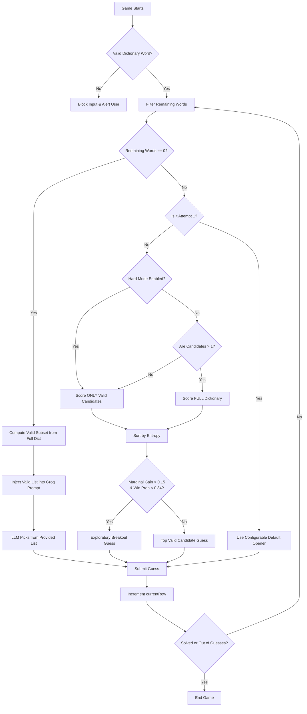

# Wordle Auto-Solver Architectural Flow

This document outlines the end-to-end architectural flow of the Wordle auto-solver, detailing how it combines Information Theory (Entropy) and Large Language Models (Groq AI) to systematically crack the game.

## 1. Initialization and Input Validation
When a game starts, the solver initializes its state. 
- **Standard Game:** The target word is randomly selected from a curated list of 2,309 common English words (`answerList`).
- **Custom Game:** The user types a custom 5-letter target. 
  > [!IMPORTANT]  
  > The system performs a strict validation check to ensure the custom word exists in the 12,000-word official dictionary (`wordList`). If it does not exist (e.g., plurals like `KNEES`), the game blocks the input. This prevents mathematical paradoxes where the target word drops the remaining valid words pool to zero.

## 2. The Entropy Engine (Attempts 1-4)
For the first four guesses, the solver operates in **Strict Hard Mode** driven by Information Theory.

### Filtering (`filterWordList`)
After every guess, the engine evaluates the visual clues (Greens, Yellows, Grays) and applies strict logical constraints to the remaining candidate pool:
- **Greens:** Must remain in their exact positions.
- **Yellows:** Must be included in the word, but in a different position.
- **Grays:** Must be completely eliminated (unless duplicates exist).

### Scoring (`rankGuesses`)
The remaining valid candidates are scored based on their **Entropy** (information gain).
1. The solver calculates how evenly a potential guess would split the remaining candidates into different clue outcomes (e.g., how many candidates result in `G-Y-X-X-G`, how many in `X-X-X-X-X`, etc.).
2. Words that evenly divide the pool into small, distinct buckets yield high entropy.
3. The candidates are sorted by entropy, and the highest scorer is selected.

> [!TIP]
> By strictly restricting the solver to score *only* valid candidates during attempts 1-4, it mathematically obeys Hard Mode constraints. It will never guess an eliminated letter or move a discovered Green letter.

## 3. The Exploratory Breakout (Attempt 5)
In Wordle, you can fall into "traps"—words with identical structures differing by a single consonant (e.g., `HATCH`, `BATCH`, `MATCH`, `PATCH`). In strict Hard Mode, testing these one by one will exhaust your 6 guesses.

To combat this, the solver utilizes a specific heuristic on the 5th attempt:
- **Condition:** If it is the 5th attempt (`currentRow === 4`) and there are still multiple valid candidates left.
- **Action:** The solver intentionally breaks out of Hard Mode. Instead of only scoring the valid candidates, it scans the *entire 12,000-word dictionary* to find an **Exploratory Guess**.
- **Result:** It finds a word (often gibberish or unrelated to the target) that perfectly tests the remaining untried consonants (e.g., guessing `CHAMP` to test C, M, P all at once).

## 4. The Final Strike (Attempt 6)
Armed with the massive information gain from the 5th exploratory guess, the solver narrows the remaining candidates down (almost always to a single word) and secures the win on the 6th and final attempt.

## 5. The LLM Fallback (Groq AI)
If the mathematical engine ever finds itself in a state where **zero valid words remain** (historically caused by an invalid custom target), the system falls back to a Large Language Model (Groq / Llama-3).

### Strict Prompt Injection
Because LLMs struggle with executing rigid positional logic in their neural networks, they frequently hallucinate invalid guesses (like placing an E in a position that was already marked gray).

To prevent this, the solver acts as a rigid guardrail:
1. The solver locally computes the exact subset of the 12,000-word dictionary that perfectly matches all visual clues gathered so far.
2. It explicitly injects this pre-validated list into the LLM's prompt.
3. It instructs the LLM: *"The ONLY dictionary words that perfectly match all Green/Yellow/Gray clues are: `[VALID_WORD_1, VALID_WORD_2]`. You MUST pick your guess from this list."*

This effectively converts a complex spatial-logic puzzle into a simple multiple-choice selection for the LLM, neutralizing its tendency to hallucinate invalid word structures.

---

