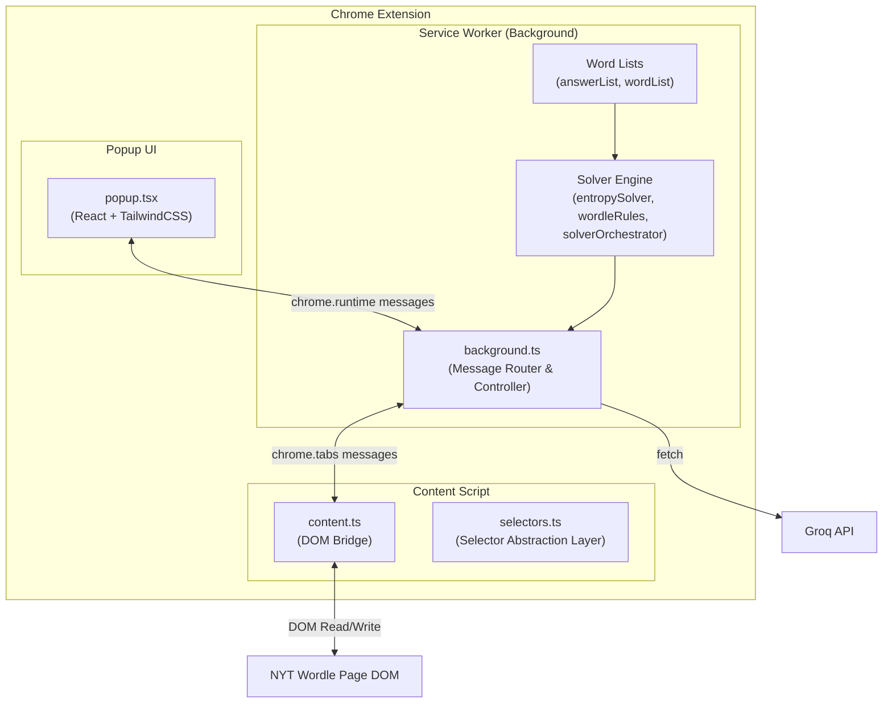
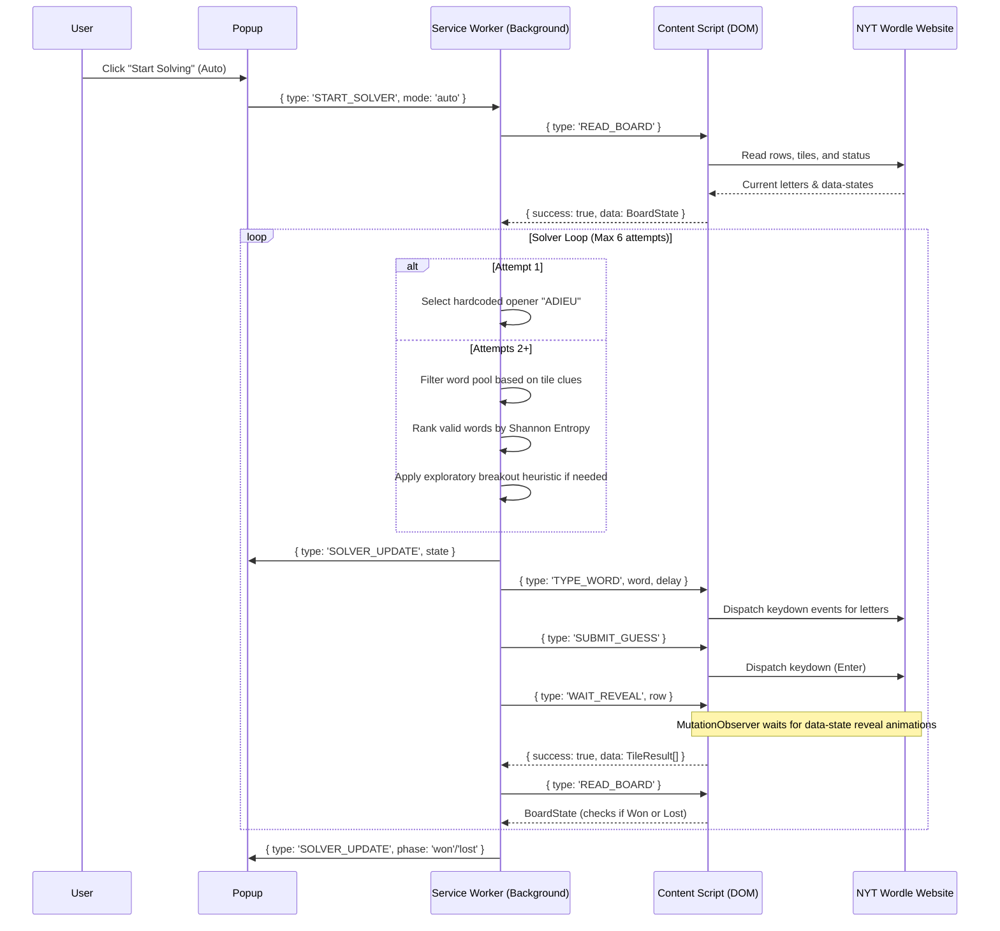

# Wordle Autonomous Agent Architectural Flow

This document outlines the end-to-end architectural flow of the browser-integrated Wordle Autonomous Agent, detailing how it connects a Manifest V3 Chrome Extension to the live New York Times Wordle page, and combines Information Theory (Entropy) with Large Language Models (Groq AI) to solve the game.

## 1. Extension Architecture Overview

The agent is split into three main layers that communicate asynchronously via Chrome Runtime APIs:

1. **Popup UI (`popup.tsx`):** A glassmorphism dark-themed control center where the user activates the solver (Auto Play or Assist Mode), configures settings (Hard Mode, LLM Fallback, Typing delay), and views live analytics (remaining words, entropy, win probability, top candidates).
2. **Service Worker / Background Script (`background.ts`):** The brain of the extension. It runs the core solve loop, manages state, computes candidate entropy, persists configuration using `chrome.storage.local`, and handles cross-origin API calls to the Groq LLM endpoint.
3. **Content Script (`content.ts` & `selectors.ts`):** The eyes and hands of the agent. Injected into the NYT Wordle page, it reads the tile letters and states, simulates keyboard input, submits guesses, and monitors animations via `MutationObserver`.

---

## 2. DOM Reading & Input Simulation

Rather than managing a simulated board in local memory, the agent reads and writes directly to the live NYT website DOM:

### DOM State Detection
- **Tiles & Rows:** Found using robust selectors (`[data-state]` and `[role="group"]`).
- **States:** Read from the `data-state` attribute (`empty`, `tbd`, `correct`, `present`, `absent`).
- **Game State:** Evaluated dynamically from the DOM tiles and verified via the browser's `localStorage` (checking the `nyt-wordle-state` game status key).

### Input Simulation
- **Keystrokes:** Triggered by dispatching `KeyboardEvent` (`keydown`) on the page `window` and `document` contexts, allowing letters to be inputted.
- **Enter Key:** Dispatched to submit guesses.
- **Human-like Delay:** Letters are typed sequentially with a configurable delay (typically ~120ms) to ensure stability and mimic human input speed.

---

## 3. The Solve Loop Workflow

---

## 4. Decision Engine Heuristics

The agent maintains the mathematical engine from the original Entropy Solver:

### Shannon Entropy Computation
Candidates are ranked by how much information they are expected to yield. For each candidate word, the solver calculates the distribution of hypothetical clues it would produce across the remaining answer pool:
\[E(w) = - \sum_{i} p_i \log_2(p_i)\]
Where \(p_i\) is the probability of obtaining clue pattern \(i\). The word with the highest entropy is selected.

### Dynamic Exploratory Breakout
To avoid consonant traps (e.g. `_ATCH` where the answer could be `HATCH`, `BATCH`, `PATCH`, `MATCH`, etc.), the agent evaluates the full dictionary:
- **Condition:** If the best full-dictionary guess yields a marginal entropy gain `> 0.15 bits` compared to the best valid candidate AND the current win probability is `< 34%`.
- **Action:** The solver breaks Hard Mode and plays an exploratory guess containing as many untried consonants as possible to narrow down the target.

### LLM Fallback (Groq AI)
If the pool of remaining valid candidates drops to zero (due to a rare dictionary mismatch or unexpected state), and `llmFallbackEnabled` is true, the service worker sends a structured prompt to Groq's `llama-3.3-70b-versatile` model:
- The prompt explicitly lists the constraints and matches computed from the dictionary.
- The LLM is forced to select a word from the remaining valid subset, eliminating hallucinated invalid word guesses.
